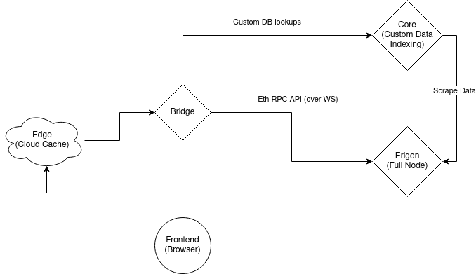

# backend/

This is the monorepo for all (up to) 4 backend services.

## Service 0: (Slightly custom) Erigon Full Node Client

All other DG backend services ultimately rely and a plain old Ethereum Full Node, in DG's case, Erigon has proven the most flexible and cost-saving Ethereum client hence the choice here.  We may add support for vanilla Ethereum clients at the cost of slowwwwww initial block history processing.

Because the vanilla Ethereum RPC API does not allow for rapidly crawling all chain history efficiently, one additional custom batch-block fetching API was added to the base Erigon client and is actively maintained against recent Erigon releases.

TODO: Publish the (slightly) modified Erigon client!

## Service 1: Core

The Core service is responsible for scraping Full Nodes to build the custom indexes required for a fast Decentralgraph.  It crawls all blocks historically up to realtime to create a baseline set of LMDB databases.  "Scanners" then listen for core changes to on-chain objects and build up ancillary LMDB indexes, such as ENS records, ERC contracts and whatever other features we end up needing!

## Service 2: Bridge

The Bridge service is a simple service that does nothing more than implement the GraphFetcher API contract by both querying the Full Node's RPC API and / or querying LMDB indexes created by Core service and thus is usually deployed alongside Core.

## Service 3: Edge

The Edge service lives in the Cloud as the first-line caching layer and auto scales to accommodate spikes in web traffic.  Like the Bridge, it implements a GraphFetcher API implementation but works by simply forwarding to Bridge on cache misses.  Edges and Bridges can be composed in an arbitrary mesh if you really wanted to be cool, or ignored entirely.

## Doc TODOs

1. How to install
2. How to run each service!
